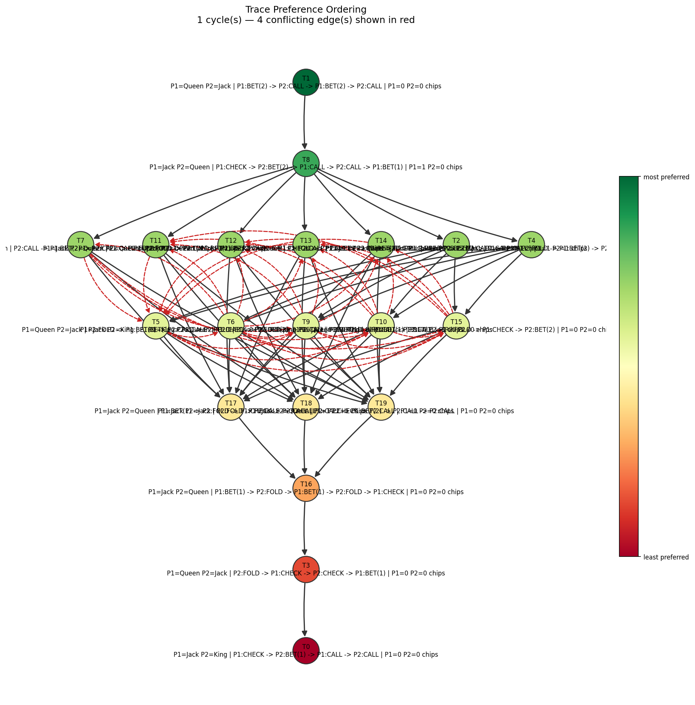
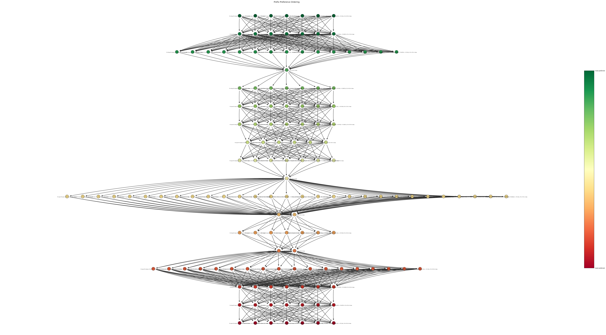

Git clone remap repo into local project s.t. you can run code such as LLM teacher. Need an antrhopic API key, can send you mine or push a hidden version here, but don't think we should be doing it this way personally.

git clone https://github.com/eric-hsiung/REMAP.git
## TODO
1. Get preference querying working for Kuhn Poker with perfect information game working. Currently have an HOA and TLSF file for Kuhn poker. Can use dot_trace_generator.py to generate a lot of traces of games for data gen
2. Need to figure out if REMAP training data intake works as I think it does.
3. Once we get reward machine LLM working we can go onto step two of L* modification

# Current Work - Christian: Monday. 

## Running the Full Pipeline — `src/run.py`

`run.py` orchestrates all four steps (trace generation → preference elicitation → consistency checking → prefix preference power set) in a single command.

```bash
python src/run.py \
  src/data/Kuhn_Poker/input/kuhn_poker.dot \
  --fmt dot \
  --aps a0,a1,a2,bs,c1hi,c1lo,c2hi,c2lo,cur_bet,deal,m1b0,m1b1,m1b2,m2b0,m2b1,m2b2,p1,p1b,p2b,p2c,p2r \
  --num 10 --length 8 \
  --traces-out src/data/Kuhn_Poker/output/kuhn_traces.txt \
  --prompt "You are evaluating a Kuhn Poker player. Prefer traces where the player bluffs with low cards and value-bets with high cards. Penalize passive play or over-bluffing." \
  --model claude-haiku-4-5-20251001 \
  --K 50 --enrich kuhn_poker --chunk-delay 10 \
  --prefs-out src/data/Kuhn_Poker/output/kuhn_prefs.json \
  --max-rounds 3 \
  --clean-out src/data/Kuhn_Poker/output/kuhn_prefs_clean.json \
  --plot src/data/Kuhn_Poker/output/pref_graph.png \
  --prefix-prefs-out src/data/Kuhn_Poker/output/prefix_preferences.json \
  --prefix-plot src/data/Kuhn_Poker/output/prefix_pref_graph.png \
  --verbose
```

### Arguments

| Flag | Description |
|---|---|
| `dot` (positional) | Path to automaton file (DOT or JSON) |
| `--fmt` | `dot` or `json` |
| `--aps` | Comma-separated atomic propositions in fixed order |
| `--num` / `--length` | Number of traces / steps per trace |
| `--traces-out` | Output path for generated traces (`.txt`) |
| `--skip-traces` | Skip Step 1 if `--traces-out` already exists |
| `--prompt` | System prompt string or path to a `.txt` file |
| `--model` | Anthropic model ID (default: `claude-haiku-4-5-20251001`) |
| `--K` | Pairs per LLM chunk (default: 50) |
| `--enrich` | `kuhn_poker` — enriches APs into readable game descriptions before sending to LLM |
| `--chunk-delay` | Seconds between LLM chunks to avoid rate limits |
| `--prefs-out` | Output path for raw pairwise preferences (`.json`) |
| `--skip-prefs` | Skip Step 2 if `--prefs-out` already exists |
| `--max-rounds` | Max LLM re-query rounds for cycle resolution (default: 3) |
| `--clean-out` | Output path for cleaned preferences after consistency check (`.json`) |
| `--plot` | Save trace preference ordering graph as PNG |
| `--prefix-prefs-out` | Output path for prefix pairwise preferences (`.json`) |
| `--prefix-plot` | Save prefix preference ordering graph as PNG |
| `--skip-prefix-prefs` | Skip Step 4 entirely |
| `--verbose` | Print step-by-step progress |

### Example Output Graphs

**Trace Preference Ordering** — each node is a generated trace; green nodes are most preferred, red are least preferred; edges point from more to less preferred; red dashed edges are MFAS cycle-breaking edges.



**Prefix Preference Ordering** — same layout over all unique trace prefixes; nodes at the same level have equal expected rank (see note below).



> **Note on same-level prefixes:** Prefix preference is derived from *expected rank* — the mean rank of all full traces reachable from that prefix. Many prefixes end up on the same level because they lead to the same set of future traces (common game states before the first branch) or because the small number of traces produces a coarse rank distribution with many ties. This is a genuine partial order, not a total order. A richer comparison (e.g. stochastic dominance over the rank distribution) would resolve more of these ties.


# Current Work - Will: Thursday & Friday, April 2nd and #rd
Built out the updated Kuhn Poker tlsf file, Consistency checker, semantics python files and preference elicitor. Essentially the Kuhn poker  tlsf file needs to be synthesized. The correct Dot and HOA are on this branch. The preference_elicitory.py takes in a text file of traces generated from the dot_trace_generator.py file and a prompt and compares them given some model. These are then outputted as a prefs.json file. The consitency_checker.py which constructs a graph and checks for cycles and then repreferences  using the LLM.

## How to run

### Step 1 — Generate traces from the automaton

```bash
python src/dot_trace_generator.py \
  src/data/Kuhn_Poker/kuhn_poker.dot \
  --fmt dot \
  --aps a0,a1,a2,bs,c1hi,c1lo,c2hi,c2lo,cur_bet,deal,m1b0,m1b1,m1b2,m2b0,m2b1,m2b2,p1,p1b,p2b,p2c,p2r \
  --num 10 \
  --length 8 \
  --out data/kuhn_poker/kuhn_traces.txt
```

| Argument | Description |
|---|---|
| `file` (positional) | Path to automaton — JSON or DOT |
| `--fmt` | `json` or `dot` |
| `--aps` | Comma-separated APs in a fixed order |
| `-n / --num` | Number of traces to generate (default: 5) |
| `-l / --length` | Steps per trace (default: 10) |
| `--cycle` | Append `cycle{1}` to each trace |
| `--out` | Output `.txt` path; omit to print to stdout |

---

### Step 2 — Elicit pairwise preferences with a player-evaluation prompt

```bash
python src/preference_elicitor.py \
  data/kuhn_poker/kuhn_traces.txt \
  --prompt "You are evaluating a Kuhn Poker player. \
Prefer traces where the player bluffs with low cards and value-bets with high cards. \
Penalize passive play (always checking) or over-bluffing." \
  --model claude-haiku-4-5-20251001 \
  --K 50 \
  --enrich kuhn_poker \
  --chunk-delay 10 \
  --output data/kuhn_poker/kuhn_prefs.json \
  --verbose
```

| Argument | Description |
|---|---|
| `traces` (positional) | `.txt` file of traces, one per line |
| `--prompt` | System prompt string **or** path to a `.txt` file containing it |
| `--model` | Anthropic model ID (default: `claude-haiku-4-5-20251001`) |
| `--K` | Pairs per LLM chunk (default: 50) |
| `--enrich` | `kuhn_poker` — translates APs to readable descriptions before sending to LLM |
| `--chunk-delay` | Seconds between chunks to avoid rate limits (default: 10) |
| `--output` | Path to write preferences JSON (default: `preferences.json`) |
| `--verbose` | Print progress to stderr |

**Output JSON format** (`kuhn_prefs.json`):
```json
[
  {"i": 0, "j": 1, "pref": 1,  "trace_i": "...", "trace_j": "..."},
  {"i": 0, "j": 2, "pref": -1, "trace_i": "...", "trace_j": "..."}
]
```
`pref = 1` → trace `i` preferred; `-1` → trace `j` preferred; `0` → indifferent.

---

### Step 3 — Check consistency and resolve preference cycles

```bash
python src/consistency_checker.py \
  data/kuhn_poker/kuhn_prefs.json \
  data/kuhn_poker/kuhn_traces.txt \
  --prompt "You are evaluating a Kuhn Poker player. \
Prefer traces where the player bluffs with low cards and value-bets with high cards. \
Penalize passive play (always checking) or over-bluffing." \
  --model claude-haiku-4-5-20251001 \
  --max-rounds 3 \
  --enrich kuhn_poker \
  --output data/kuhn_poker/kuhn_prefs_clean.json \
  --plot data/kuhn_poker/pref_graph.png \
  --verbose
```

| Argument | Description |
|---|---|
| `prefs` (positional) | Preferences JSON from Step 2 |
| `traces` (positional) | Same `.txt` traces file used in Step 2 |
| `--prompt` | Same system prompt (or file path) used in Step 2 |
| `--model` | Anthropic model ID |
| `--max-rounds` | Max LLM re-query rounds before dropping cycle edges (default: 3) |
| `--enrich` | `kuhn_poker` enricher |
| `--output` | Path to write cleaned preferences JSON; omit to print to stdout |
| `--plot` | Save preference graph as PNG (green edges = consistent, red = cyclic MFAS edges) |
| `--verbose` | Print cycle/MFAS progress to stderr |

---

### Full pipeline in one block

```bash
# 1. Generate traces
python src/dot_trace_generator.py \
  src/data/Kuhn_Poker/kuhn_poker.dot \
  --fmt dot \
  --aps a0,a1,a2,bs,c1hi,c1lo,c2hi,c2lo,cur_bet,deal,m1b0,m1b1,m1b2,m2b0,m2b1,m2b2,p1,p1b,p2b,p2c,p2r \
  --num 10 --length 8 \
  --out data/kuhn_poker/kuhn_traces.txt

# 2. Elicit preferences
python src/preference_elicitor.py \
  data/kuhn_poker/kuhn_traces.txt \
  --prompt "You are evaluating a Kuhn Poker player. Prefer traces where the player bluffs with low cards and value-bets with high cards. Penalize passive play or over-bluffing." \
  --enrich kuhn_poker \
  --output data/kuhn_poker/kuhn_prefs.json \
  --verbose

# 3. Check consistency -> cleaned JSON
python src/consistency_checker.py \
  data/kuhn_poker/kuhn_prefs.json \
  data/kuhn_poker/kuhn_traces.txt \
  --prompt "You are evaluating a Kuhn Poker player. Prefer traces where the player bluffs with low cards and value-bets with high cards. Penalize passive play or over-bluffing." \
  --enrich kuhn_poker \
  --output data/kuhn_poker/kuhn_prefs_clean.json \
  --plot data/kuhn_poker/pref_graph.png \
  --verbose
```

> **Note:** `--prompt` accepts either an inline string or a path to a `.txt` file. Storing the prompt in a file (e.g. `data/kuhn_poker/player_eval_prompt.txt`) and passing that path keeps Steps 2 and 3 guaranteed to use the same prompt without copy-paste drift.


# Current Work - Christian: Saturday, March 28th

Here is the new source code we have. I realistically need to spend some time doing a more thorough analysis of what the code does.
I used a lot of Claude that took from the existing source code with the goal to reorganize it with a focus on removing the LLM querying from within the core algorithm.
That way, we can focus on optimizing the LLM querying step as an isolated component. This aligns more so with the proposal's desire to precompute the LLM queries.
However, I need to spend more time analyzing each function and I am sure we could benefit from unit tests to actually make sure we know what occurs at each step.

Right now, we know there is a major issue with what symbolic L* attempts to query and:

1. If it exists in the cache?
2. How do we assign preferences to prefix closure in cache? (Currently Using a Claude Technique I have not manually verified: *Place Holder*).
3. How do we handle illegal moves queried from symbolic L* if that is even possible or I am doing something horribly off.


These remain the key issues. Regardless, this new format, is a good start at isolating the LLM querying step which we wanted.

## Pipeline:

### run.py

Orchestrates all four steps:
  1. Generate corpus T          (skipped if corpus.json exists)
  2. Pre-compute cache          (skipped if cache.json exists)
  3. Run symbolic L*            (always)
  4. Evaluate learned machine   (always)

### corpus/generate.py

Builds the finite trace corpus T = {t_1, ..., t_N} from the Kuhn Poker
DOT machine and writes it to corpus/corpus.json. Utilizes `dot_trace_generator.py` from original source.

Two modes (set in config.py):
  "exhaustive" — DFS over the automaton; yields all 62 legal Kuhn Poker hands.
  "sampled"    — random walks from the initial state; yields CORPUS_SAMPLE_SIZE hands.

### precompute/build_cache.py

Runs classification, preference pre-computation, and prefix-closed
extension over the corpus, then writes everything to precompute/cache.json.

#### precompute/classify.py

Uses either a deterministic/LLM back-end to assign every trace t_i in the corpus a label in sigma_O = {-1, 0, 1}:

  -1  P2 loses  (hand ends with _W1)
   0  in progress  (no terminal outcome symbol)
   1  P2 wins   (hand ends with _W2)

The result is stored in precompute/cache.json under the key "classifications":

### precompute/preferences.py

Computes pairwise preferences over the corpus T before learning begins,
so that symbolic_lstar never needs to make a live LLM call.

Two strategies (set in config.py):
  "all_pairs"  — compare every (i, j) pair; O(N^2/2) calls.
                 Feasible for N=62 (1891 pairs).
  "quicksort"  — randomised quicksort order; O(N log N) calls.
                 Scales to larger corpora.

Both strategies write their results to precompute/cache.json under "preferences":

### precompute/prefix_tree.py

Extends the classification dict to be prefix-closed using minimax aggregation.

Aggregation uses minimax:
  P2 decision nodes  (children start with P2_ or P2B_) → max over children
  P1 decision nodes  (children start with P1_ or P1B_) → min over children
  Chance nodes       (children start with DEAL_)        → average over children

This reflects rational strategic reasoning:
  P2 is the agent whose quality we evaluate → P2 plays optimally (max)
  P1 is the opponent                        → P1 plays adversarially (min)
  Card dealing is random                    → average

**This strategy was more so decided by Claude. This is not meant to be a finished strategy. Rather, I wanted some placeholder to start us off while we spend more time figuring that out.**

**I need to spend some time evaluating this strategy**

### teacher/cached_teacher.py

A drop-in teacher for symbolic_lstar that answers all queries from the
pre-computed cache — no live LLM calls during learning.

*Current Issues:*

`preference_query` is not correctly querying the cache. It attempts to query for prefixes that are not valid Kuhn Poker moves (prefix w/ one atom that is not a DEAL). Because of that it, defaults to a fall_back case that uses deterministic preference querying. What I am noticing occur is that, just comparing the first token/atom in the prefix 

--- 
**LLM NOTES**:

  To run with LLM, place your API key at
  ---erfect_Information_Automata_Learning/.env/api_key and run:
  What's in the cache
  .venv/bin/python src/pipeline/run.py --backend llm --regen-cache
  The cache classifications dict has keys that are |-joined game sequences:

  ""                                           ← empty prefix (root of game tree)
  "DEAL_King_Queen"                            ← after deal only
  "DEAL_King_Queen|P1_King_Queen_check"        ← deal + P1 checks
  "DEAL_King_Queen|P1_King_Queen_check|P2_King_Queen_bet_none"  ← P2 then bets
  "DEAL_King_Queen|P1_King_Queen_check|P2_King_Queen_bet_none|P1B_King_Queen_call_W1"  ← P1 calls, P1 wins (leaf)

  Notice the pattern: keys always START with DEAL_. Real Kuhn poker games always begin with a deal.

  ---
  What L* actually queries

  L* builds an observation table. Rows are prefixes it tracks. Initially there are 61 rows:
  - 1 row: the empty sequence ()
  - 60 rows: every single symbol in σ_I, like ('DEAL_King_Queen',), ('P1_King_Queen_bet',), ('P2B_King_Jack_call_W1',), etc.

  To fill the table, L* compares pairs of rows by calling preference_query. Here are three representative comparisons:

  ---
  Example 1 — Tier 2 hit (both in prefix tree)

  s1 = ('DEAL_King_Queen',)   →   key = "DEAL_King_Queen"   ✓ in cache
  s2 = ('DEAL_Queen_King',)   →   key = "DEAL_Queen_King"   ✓ in cache

  Tier 2: raw1 = -1.0,  raw2 = +1.0
          v1   = -1,    v2   = +1
          → return -1  (s2 preferred, P2 wins with Queen_King deal)

  Both are valid game-starting symbols. Both appear as the first step of corpus traces. Both are in the prefix tree.

  ---
  Example 2 — Tier 3 hit (one is NOT in the prefix tree)

  s1 = ('DEAL_King_Queen',)   →   key = "DEAL_King_Queen"   ✓ in cache
  s2 = ('P1_King_Queen_bet',) →   key = "P1_King_Queen_bet" ✗ NOT in cache

  P1_King_Queen_bet is P1's first action — it can only appear as step 2 of a game (after the deal). No corpus trace ever STARTS with it, so it has no prefix tree entry.

  Tier 2's condition is k1 in classifications AND k2 in classifications. k2 fails → falls to Tier 3.

  Tier 3 calls classify_deterministic:
  - ('DEAL_King_Queen',) → no _W1/_W2 in symbol → returns 0
  - ('P1_King_Queen_bet',) → no _W1/_W2 in symbol → returns 0
  - Both 0 → return 0 (equal)

  This is semantically correct: neither sequence represents a finished game, so both are "in progress."

  ---
  Example 3 — Tier 3 hit (terminal single-symbol)

  s1 = ('P1B_King_Queen_call_W1',)  →  key not in cache (can't start a game)
  s2 = ('DEAL_King_Queen',)         →  key "DEAL_King_Queen" ✓ in cache

  Again Tier 2 fails because s1 isn't in the cache.

  Tier 3 calls classify_deterministic:
  - ('P1B_King_Queen_call_W1',) → symbol ends in _W1 → P1 wins → returns -1
  - ('DEAL_King_Queen',) → no _W1/_W2 → returns 0
  - -1 < 0 → return -1 (s2 preferred)

  This is also semantically correct: _W1 encoded in the symbol name literally means "P1 won here."

  ---
  Why Tier 3 handles everything correctly here

  The 60 symbols in σ_I divide into two groups:

  ┌────────────────────────────┬──────────────────────────────────────────────┬──────────┬────────────────────────┐
  │        Symbol type         │                   Example                    │ _W1/_W2? │ classify_deterministic │
  ├────────────────────────────┼──────────────────────────────────────────────┼──────────┼────────────────────────┤
  │ DEAL_*                     │ DEAL_King_Queen                              │ no       │ 0 (in progress)        │
  ├────────────────────────────┼──────────────────────────────────────────────┼──────────┼────────────────────────┤
  │ P1_* / P2_* (intermediate) │ P1_King_Queen_bet, P2_Jack_King_bet_none     │ no       │ 0 (in progress)        │
  ├────────────────────────────┼──────────────────────────────────────────────┼──────────┼────────────────────────┤
  │ P1B_* / P2_* (terminal)    │ P1B_King_Queen_call_W1, P2_Jack_King_fold_W1 │ yes      │ ±1                     │
  └────────────────────────────┴──────────────────────────────────────────────┴──────────┴────────────────────────┘

  The W1/W2 outcome is encoded in the symbol name itself by the game representation. So classify_deterministic is ground-truth correct for single-symbol sequences — no LLM needed.

  ---
  Why this matters for LLM

  When you switch to --backend llm, the leaf labels come from Claude instead of the symbol scanner. But single-symbol queries (which dominate the 327 queries) still fall to Tier 3 — and for single symbols, Tier 3 is
  provably correct regardless of backend, because the outcome is in the symbol name.

  The LLM's opinion only matters for complete multi-symbol traces (the leaf labels). Tier 2 propagates those opinions up to intermediate prefixes via minimax. Tier 3 handles the edge cases that can never start a real
   game.

❯ so in our last run, we had no multi symbol traces? why not                

⏺ Good question. Two things are happening:

  ---
  Reason 1: Initial suffix set is just {ε}

  L* compares row + suffix entries. At initialization, the only suffix is the empty sequence (). So every comparison is:

  row_i + ()  vs  row_j + ()
  =  row_i        vs  row_j

  The rows at initialization are the 60 single-symbol entries + (). So every query in round 1 is single-symbol by construction — no multi-symbol sequences exist yet.

  Multi-symbol queries appear only when L* adds new suffixes (during consistency checks) or promotes a row to the upper table (during closure) and then extends it. But in our run, the equivalence check passed on the
  first try — L* never needed a second suffix.

  ---
  Reason 2: The 60 symbols already split into exactly 3 classes

  Look at the 60 symbols by their _W1/_W2 ending:

  ┌─────────┬──────────────────────────────────────────────────────┬────────────────────────┐
  │  Group  │                   Example symbols                    │ classify_deterministic │
  ├─────────┼──────────────────────────────────────────────────────┼────────────────────────┤
  │ Has _W2 │ P1B_Jack_King_call_W2, P2_Jack_King_check_W2         │ 1 (P2 wins)            │
  ├─────────┼──────────────────────────────────────────────────────┼────────────────────────┤
  │ Has _W1 │ P1B_King_Jack_fold_W2... wait, P2B_Jack_King_fold_W1 │ -1 (P1 wins)           │
  ├─────────┼──────────────────────────────────────────────────────┼────────────────────────┤
  │ Neither │ DEAL_*, P1_*_bet, P2_*_bet_none, P1B_*_raise_none    │ 0 (in progress)        │
  └─────────┴──────────────────────────────────────────────────────┴────────────────────────┘

  Those 3 groups = 3 equivalence classes = exactly the 3-state reward machine. L* identified them from single-symbol comparisons alone, built a 3-state hypothesis, and the equivalence check passed immediately on all
  62 corpus traces.

  ---
  When would multi-symbol sequences appear?

  If the equivalence check had failed, it would return a counterexample — a multi-symbol trace from the corpus like:

  ('DEAL_King_Queen', 'P1_King_Queen_check', 'P2_King_Queen_bet_none', 'P1B_King_Queen_call_W1')

  L* would then add a new suffix derived from that trace, which causes the next round to compare sequences like:

  ('DEAL_King_Queen',) + ('P1_King_Queen_check', ...) = 4-symbol sequence

  That 4-symbol sequence IS in the corpus prefix tree → would hit Tier 2.

  For the LLM backend, if the LLM labels introduce ambiguity (e.g., classifying some hands as draws instead of wins/losses), the equivalence check might fail and trigger those deeper multi-symbol comparisons — which
  is where Tier 2 was specifically designed to help.

✻ Baked for 1m 1s

❯ I see so because we were able to learn an autoamta with just the singular 
 symbol prefixes, we never needed to check our multi symbol ones            
⏺ Exactly. The 3-state machine was "visible" from just the single-symbol
  level because the outcome (_W1, _W2, or neither) is encoded directly in
  each terminal symbol's name. L* found the solution in one pass without
  needing to look deeper.

  The more interesting case — and the one Tier 2 was built for — is the LLM
  backend, where:

  1. The LLM labels complete multi-symbol traces based on strategic quality,
   not just symbol names
  2. Its preferences might not map cleanly onto 3 classes from single
  symbols alone
❯ here is what concerns me. Let's say we use an LLM to compute on the full  
traces, and then we create our prefix closure-based cache. Would we not     
learn from the start symbols anways? we only give the LLM real traces that  
⏺lYou've just identified the core problem with the current design.          
  prefix tree — Tier 2 kicks in with minimax-derived values rooted in the
  ---'s own judgments
  The issue
  So the deterministic run validating correctness is good, but it's
  Look at the symbols in sigma_I:o for the cache. The LLM run is where the
  prefix-closed cache design actually gets exercised.
  P2_Jack_King_fold_W1     ← W1 is literally in the name → P1 wins
  P1B_King_Queen_call_W2   ← W2 is literally in the name → P2 wins
  P1_King_Queen_bet        ← no W → in progress
  DEAL_King_Queen          ← no W → in progress

  The outcome is encoded in the symbol name. classify_deterministic just reads it. So when L* compares single-symbol sequences at initialization, it's not consulting the LLM's judgment — it's reading symbol names.
  The LLM is never involved.

  The 3-state machine gets learned correctly, but for the wrong reason: symbol name parsing, not strategic reasoning.

  ---
  Why this matters

  Your project goal is to see if an LLM's strategic understanding of Kuhn poker can be captured in an automaton. But with this setup:

  1. Single-symbol comparisons → Tier 3 → deterministic → LLM not consulted
  2. L* finds 3 states → equivalence check passes → done
  3. LLM labels on complete traces: never looked at during learning

  You'd get the same result with or without the LLM.

  ---
  The fix

  The symbols need to be opaque — they shouldn't encode their outcome. Instead of P2_Jack_King_fold_W1, use something like P2_Jack_King_fold and let the LLM's classification be the only source of truth about who won.

  With opaque symbols:
  - classify_deterministic returns 0 for everything (no W1/W2 to scan)
  - Tier 3 fallback becomes meaningless
  - L* is forced to rely on Tier 1 (complete-trace preferences from LLM) and Tier 2 (minimax propagation from those LLM labels)
  - The LLM's strategic judgment actually drives what the automaton looks like

  This is a meaningful change to the game representation and worth discussing with your advisor — it determines whether you're learning "from the LLM" or learning "from symbol names with LLM labels that happen to
  agree."

**END OF LLM RESPONSE**

---


### teacher/deterministic_teacher.py

Deterministic teacher and reward machine for Kuhn Poker.

No LLM. All preferences are derived directly from game outcomes and
strategic quality, both encoded in the DOT machine symbols.

Used by corpus/generate.py and evaluate.py

### evaluate.py

Compares the learned hypothesis against the ground-truth reward machine
produced by build_kuhn_reward_machine() and prints a summary.
